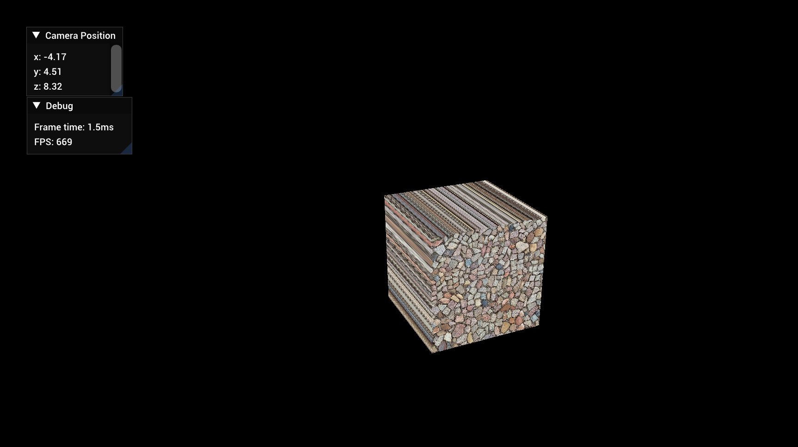

# Piksela

---

A proof-of-concept 3D game engine demonstrating:

- Hardware Accelerated Rendering
- Textures
- Shaders
- 3D Camera Systems
- Input Handling
- Debug Logging

## Installation

Piksela likely will not compile on non-Windows devices.

1. Clone the repository.
2. Install [bazel](https://bazel.build/start).
3. Enter the command `bazel build PikselaEditor`
4. Run the executable with `cd bazel-bin && PikselaEditor.exe`

## Controls

Use WASD to maneuver the camera position, and click and drag with the mouse to rotate the camera.

## Technologies

Piksela was built using the following Open Source projects:

- Bazel: C++ build system
- OpenGL: Hardware accelerated graphics API
- GLFW: Cross-platform window manager
- imgui: Immediate mode GUI
- spdlog: Efficient logging
